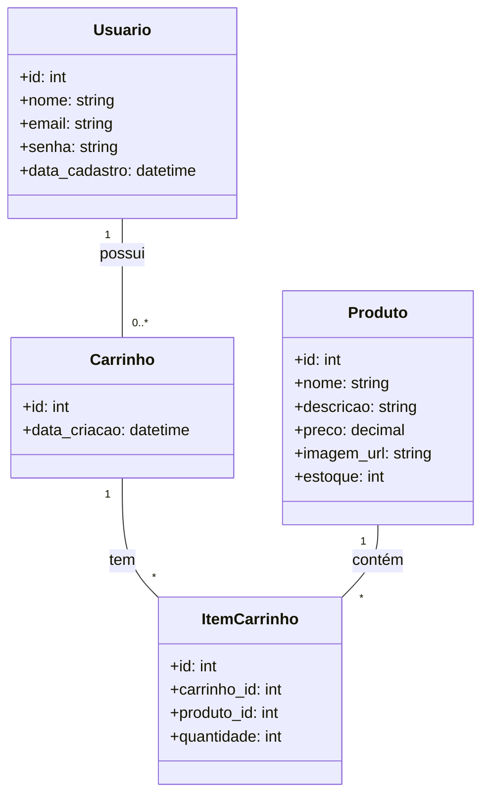

# e-comerce

## Objetivos
<li> Criar um e-comerce totalmente do Zero
<li> Criado totalmente por mim, apenas com pesquisas e sem cópia de códigos já prontos
<li> Utilização apenas de I.A para auxílio com erros
<li> Integração entre BackEnd, FrontEnd, Banco de Dados e Aplicação em Nuvem

## Diagrama de classes

